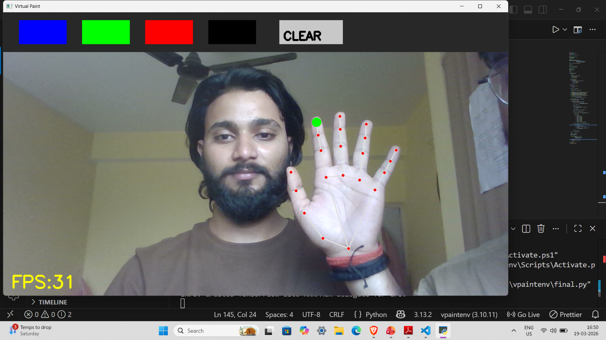

# 🎨 Virtual Paint — Draw in the Air Using Finger Tracking

A computer vision project that allows users to draw in the air using finger movements without touching the screen. The project uses a webcam to detect hand landmarks in real time and tracks the index finger to create a virtual drawing experience.

---

## 📖 Project Overview

Virtual Paint is a gesture-controlled drawing application built using **Python**, **OpenCV**, and **MediaPipe**. The webcam captures hand movements, while MediaPipe detects hand landmarks. The index finger acts as a virtual brush, allowing users to draw on the screen by simply moving their finger in the air.

This project demonstrates the practical use of computer vision, hand tracking, and real-time image processing.

---

## ✨ Features

- 🎨 Draw in the air using your index finger
- 👆 Real-time hand tracking
- 📷 Webcam-based interaction
- 🖌️ Virtual brush functionality
- ⚡ Smooth and responsive drawing
- 💻 Touch-free user experience

---

## 🛠 Technologies Used

- Python
- OpenCV
- MediaPipe
- NumPy

---

## 📦 Requirements

Install the required libraries:

```bash
pip install opencv-python mediapipe numpy
```

---

## ▶️ How to Run

1. Clone the repository.

```bash
git clone https://github.com/AbhishekVicky/Virtual-Paint.git
```

2. Open the project folder.

```bash
cd Virtual-Paint
```

3. Run the Python file.

```bash
python main.py
```

4. Allow camera access.

5. Start drawing using your index finger.

---

## ⚙️ How It Works

1. The webcam captures live video.
2. MediaPipe detects the user's hand.
3. The index fingertip position is tracked.
4. Finger movement is converted into drawing coordinates.
5. The drawing is displayed on the virtual canvas in real time.

---

## 📸 Project Demo

Add screenshots or GIFs inside the **images/** folder.

Example:

```
images/
├── cover.png
├── finger_tracking.png
```

Then display them:

```markdown

```

---

## 🚀 Applications

- Virtual Drawing
- Digital Whiteboard
- Gesture-Based Interaction
- Interactive Learning
- Computer Vision Projects
- Human-Computer Interaction

---

## 🔮 Future Improvements

- Multiple brush colors
- Brush size adjustment
- Eraser mode
- Save drawings as images
- Shape recognition
- AI-powered gesture commands
- Multi-hand support

---

## 📚 Skills Learned

- Computer Vision
- OpenCV
- MediaPipe
- Python Programming
- Hand Tracking
- Image Processing
- Real-Time Video Processing

---

## 👨‍💻 Author

**Abhishek Kumar**

GitHub: https://github.com/AbhishekVicky

LinkedIn: https://www.linkedin.com/in/abhivicky/

---

⭐ If you found this project useful, consider giving it a star!
